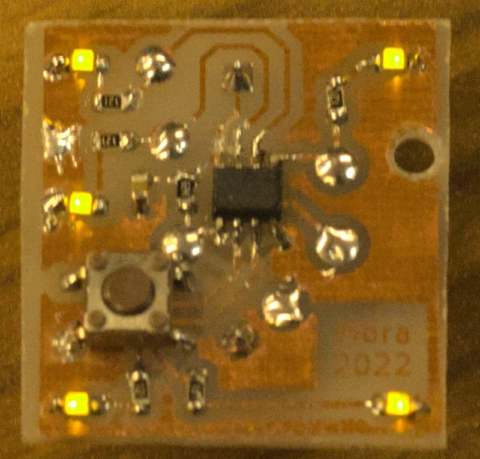

Mora-blinker
========== 
## Goals
  
- Provide a simple and cheap educational embedded project
- Demonstrate basic electric design 
- Demonstrate both C++ basics and advanced tricks
- More entertaining first program than a 'Hello world'
- Educate for software design in low-end environment
   
## Known issues  
  
- Fuse calculation could be more describing
- May further optimize base code
- Less numeric constant

## Work of a student

